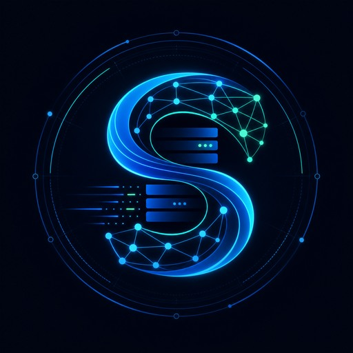

<p align="center">
  
</p>

<h1 align="center">Seven Data AI</h1>

<p align="center">
  AI Workflow · Data Automation · Data Agent · NL2SQL · SQL Review
</p>

<p align="center">
  <a href="https://github.com/SevenDataAI/ai-workflow-recipes">AI Workflow Recipes</a>
  ·
  <a href="https://github.com/SevenDataAI/data-agent-eval-kit">Data Agent Eval Kit</a>
  ·
  <a href="https://github.com/SevenDataAI/dify-workflow-generator">Dify Workflow Generator</a>
</p>

---

我关注的是一件具体的事：

**怎么把重复、低价值、容易出错的工作，变成 AI 可以稳定执行的工作流。**

AI 不应该只停留在聊天框里。真正有价值的是把一类任务拆成：

```text
输入标准
  -> 规则判断
  -> AI 生成
  -> 工具执行
  -> 结果校验
  -> 日志沉淀
  -> Bad Case 回流
```

AI 负责理解、生成和解释；确定性的部分交给代码、规则、模板、工作流引擎和自动化工具。

## What I Build

### AI Workflow for Real Work

把 Dify、n8n、Claude SDK、Codex、MCP、CLI、飞书和脚本组合起来，沉淀成可复用流程。

典型场景：

- 内容创作：选题、脚本、封面、评论回复、素材入库
- 办公自动化：会议纪要、周报、资料整理、文档改写
- 知识库：文档清洗、目录重构、FAQ 生成、试读页优化
- 数据工作：AI 问数、AI 取数、SQL Review、指标异常归因

### Data Automation

我更熟悉的数据场景是：

- 数据需求澄清
- 指标口径对齐
- SQL 生成和审查
- 敏感字段和权限拦截
- 数据质量规则
- Bad Case 归因
- AI 问数 / NL2SQL 评测

这些内容会沉淀成开源模板和生产级案例。

### Agent Engineering

我会重点研究 Agent 里的工程化问题：

- 哪些步骤应该让 AI 判断
- 哪些步骤必须规则化
- 如何做工具调用和权限边界
- 如何做可观测、评测和回归
- 如何把 Prompt 变成可维护的 workflow
- 如何让一个 Agent 系统从 Demo 走向生产

## Public Projects

### [`ai-workflow-recipes`](https://github.com/SevenDataAI/ai-workflow-recipes)

普通人也能用的 AI 工作流模板库。

它不是 Prompt 合集，而是把真实工作拆成：

- 输入
- AI 节点
- 规则节点
- 工具节点
- 人工确认
- 输出物
- Bad Case

当前包含：

- 视频选题到发布计划
- 会议纪要到行动计划
- CSV / Excel 数据分析报告
- AI 生成 SQL 审查门禁

后续会继续补 Dify、n8n、Claude SDK、Codex、LangGraph 的映射模板。

### [`data-agent-eval-kit`](https://github.com/SevenDataAI/data-agent-eval-kit)

面向 AI 问数、AI 取数和 NL2SQL 的评测模板库。

它解决的问题不是“怎么让模型写 SQL”，而是：

- 生成的 SQL 口径是否正确
- 是否用了错误字段
- 是否漏了分区条件
- 是否查询了敏感字段
- 是否和 baseline SQL 一致
- Prompt 或模型调整后是否出现回归

包含内容：

- Gold Case 模板
- 交易主题样例
- baseline SQL
- SQL Review 规则
- Bad Case 分类
- 轻量评测脚本
- 生产上线检查清单

### [`dify-workflow-generator`](https://github.com/SevenDataAI/dify-workflow-generator)

用 Python 生成 Dify workflow 的工具。

我后续会把它改造成更实用的方向：

- 输入一份 `workflow.yaml`
- 生成 Dify DSL
- 支持数据问答、知识库问答、SQL Review、内容生成等模板
- 自动输出节点说明和使用文档
- 支持和 n8n / Claude SDK / Codex 工作流互相映射

### [`ruma-runtime`](https://github.com/SevenDataAI/ruma-runtime)

面向 Codex、Claude Code、OpenClaw 的 Agent 工作模式框架。

核心是把 Agent 的执行方式标准化：

- 先读证据，再下结论
- 先跑验证，再说完成
- 失败后换路线，不重复空转
- 输出可复查的日志、命令、文件和结果

## Current Roadmap

### 1. AI Workflow Recipes

整理一批普通人也能用的 AI 工作流模板：

- 小红书内容生产工作流
- 视频脚本生成工作流
- 微信私信回复工作流
- 飞书知识库入库工作流
- 周报 / 会议纪要自动整理工作流
- Excel / CSV 数据分析工作流

### 2. Data Agent Templates

沉淀数据团队可直接复用的模板：

- AI 问数评测集
- SQL Review 规则库
- 指标口径匹配模板
- DWD / DWS / ADS 设计检查清单
- 数据异常归因 SOP
- AI 取数需求澄清模板

### 3. Workflow Factory

把同一个业务流程生成到不同平台：

```text
workflow.yaml
  -> Dify DSL
  -> n8n workflow JSON
  -> Claude SDK scaffold
  -> LangGraph code
  -> Mermaid architecture diagram
```

目标不是做一个大而全的平台，而是先把高频场景做成可复制的模板。

## Content Direction

我会持续输出这些主题：

- 别再只会问 AI，真正提效的是 workflow
- 什么步骤适合交给 AI，什么步骤必须写死
- Dify、n8n、Claude SDK、Codex 分别适合什么场景
- Data Agent 为什么不能只看 Demo
- AI 问数上线前为什么必须做评测和观测
- 数据工程师如何把 AI 变成生产力，而不是玩具

你也可以在这些平台找到我：

- 抖音 / B站 / 小红书：`Seven聊数仓AI`
- 微信：`SevenDataAI`

## My Principle

我不相信“万能 Agent”。

真正能落地的 AI 系统，一定是：

- 能拆任务
- 有规则边界
- 有工具调用
- 有日志记录
- 有错误归因
- 有人工确认
- 有持续迭代

AI 的价值不是替你乱跑一遍流程，而是帮你把可重复的工作沉淀成稳定的系统。
